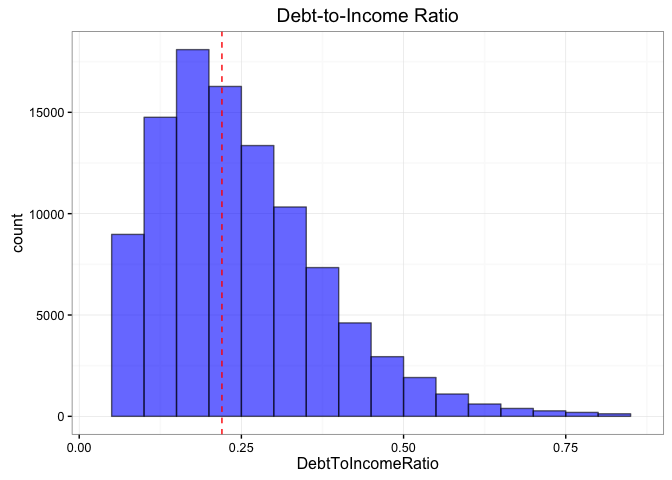
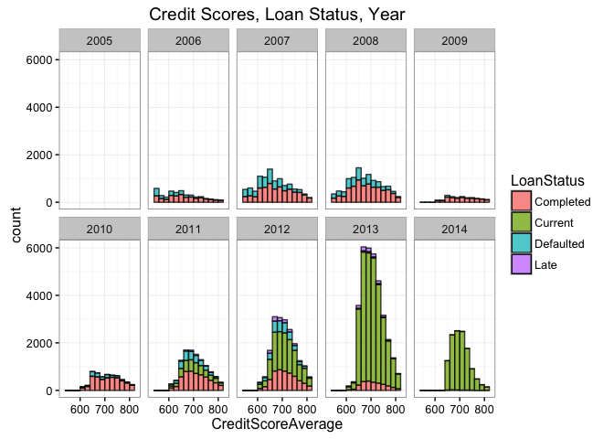
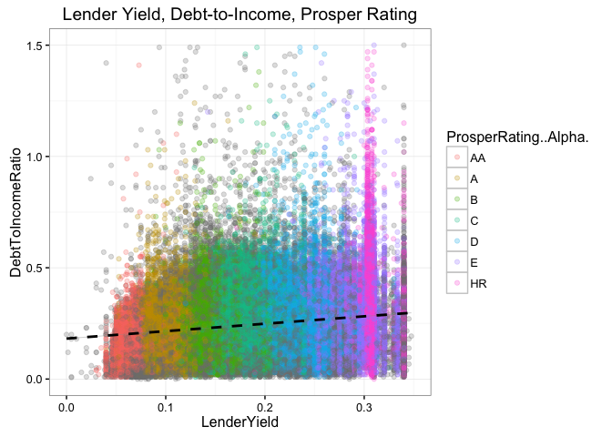
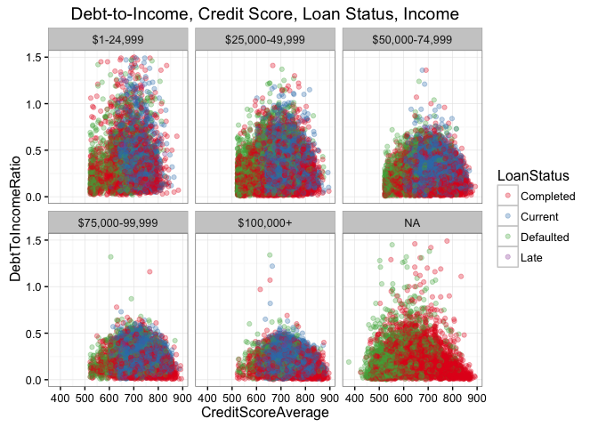

# Prosper - Exploratory Data Analysis

## Summary

This project is a exploratory data analysis of the Prosper (peer-to-peer, P2P, lending) dataset. The goal of this analysis is to understand the relationship between the financial variables/features and create univariate, bivariate, multivariate plots. In particular, the following questions were investigated:

1.) What financial variables/features are correlated with credit score?     
2.) What financial variables/features are correlated with loan status?    
3.) How has Prosper's lending changed from 2005 to 2014?     

## Methods

### Data

https://www.google.com/url?q=https://s3.amazonaws.com/udacity-hosted-downloads/ud651/prosperLoanData.csv&sa=D&ust=1455413479145000&usg=AFQjCNHQpZD2tz00FVG6trQuyWr5tBzXnA

### Hardware and Software Versions

Software: R 3.2.3, RStudio 0.99.491     
Operating System: Mac OS X 10.11.3      
Hardware: Intel Core 2 Duo 2.4 GHz, 4 GB RAM      


```r
sessionInfo()
```

```
## R version 3.2.3 (2015-12-10)
## Platform: x86_64-apple-darwin13.4.0 (64-bit)
## Running under: OS X 10.11.3 (El Capitan)
##
## locale:
## [1] en_US.UTF-8/en_US.UTF-8/en_US.UTF-8/C/en_US.UTF-8/en_US.UTF-8
##
## attached base packages:
## [1] stats     graphics  grDevices utils     datasets  methods   base     
##
## loaded via a namespace (and not attached):
##  [1] magrittr_1.5    formatR_1.2.1   tools_3.2.3     htmltools_0.3  
##  [5] yaml_2.1.13     stringi_1.0-1   rmarkdown_0.9.2 knitr_1.12.3   
##  [9] stringr_1.0.0   digest_0.6.9    evaluate_0.8
```

## Analysis


```r
library(ggplot2)
library(lubridate)
library(gtools)
library(gridExtra)
library(GGally)
library(dplyr)
```


```r
# inport data
raw_data <- read.csv("prosperLoanData.csv", header=TRUE,
    na.strings=c("NA","","Not available","Not displayed",
                 "Not employed","Other","$0") )
```


```r
# make copy of data to transform/update
data <- raw_data

# transform into date/time ojects
data$ListingCreationDate <- ymd_hms(as.character(data$ListingCreationDate))
data$ClosedDate <- ymd_hms(as.character(data$ClosedDate))
data$DateCreditPulled <- ymd_hms(as.character(data$DateCreditPulled))
date_credit <- data$FirstRecordedCreditLine
data$FirstRecordedCreditLine <- ymd_hms(as.character(date_credit))
data$LoanOriginationDate <- ymd_hms(as.character(data$LoanOriginationDate))

# convert to logical data
data$IsBorrowerHomeowner <- as.logical((data$IsBorrowerHomeowner))
data$CurrentlyInGroup <- as.logical((data$CurrentlyInGroup))
data$IncomeVerifiable <- as.logical((data$IncomeVerifiable))

# add credit score average column
credit_mean <- (data$CreditScoreRangeLower + data$CreditScoreRangeUpper) / 2
data$CreditScoreAverage <- credit_mean
data$CreditScoreAverage[data$CreditScoreAverage < 100] <- NA

# add credit history (years) column
chistory <- (data$LoanOriginationDate - data$FirstRecordedCreditLine) / 365
data$CreditHistory.Years <- as.numeric(chistory)

# loan status into fewer groups
data$LoanStatus <- as.character(data$LoanStatus)
data$LoanStatus[ data$LoanStatus == "Past Due (>120 days)" ] <- "Late"
data$LoanStatus[ data$LoanStatus == "Past Due (1-15 days)" ] <- "Late"
data$LoanStatus[ data$LoanStatus == "Past Due (16-30 days)" ] <- "Late"
data$LoanStatus[ data$LoanStatus == "Past Due (31-60 days)" ] <- "Late"
data$LoanStatus[ data$LoanStatus == "Past Due (61-90 days)" ] <- "Late"
data$LoanStatus[ data$LoanStatus == "Past Due (91-120 days)" ] <- "Late"
data$LoanStatus[ data$LoanStatus == "FinalPaymentInProgress" ] <- "Completed"
data$LoanStatus[ data$LoanStatus == "Chargedoff" ] <- "Defaulted"
data$LoanStatus[ data$LoanStatus == "Cancelled" ] <- NA
data$LoanStatus <- as.factor(data$LoanStatus)
data = subset(data, !is.na(LoanStatus))

# convert year/quarter columns
data$LoanOriginationYearQuarter <- as.character(data$LoanOriginationDate)
data$LoanOriginationYearQuarter <- quarter(data$LoanOriginationYearQuarter,
                                           with_year = TRUE)
data$Year <- as.factor( year(data$LoanOriginationDate) )

# convert delinquencies into groups
data$TotalDelinquencies <- data$CurrentDelinquencies +
    data$DelinquenciesLast7Years
data$TotalDelinquencies[ data$TotalDelinquencies == 1] <- 1
data$TotalDelinquencies[ data$TotalDelinquencies == 2] <- 1
data$TotalDelinquencies[ data$TotalDelinquencies == 3] <- 1
data$TotalDelinquencies[ data$TotalDelinquencies > 3] <- 4
data$TotalDelinquencies <- as.factor(data$TotalDelinquencies)
levels(data$TotalDelinquencies) <- c('0', '1-3','4+')

# make delinquencies True False column
data$Delinquencies <- TRUE
data$Delinquencies[ data$TotalDelinquencies == '0'] <- FALSE
```

### Preview Data


```r
dim(data)
```

```
## [1] 113932     87
```

```r
names(data)
```

```
##  [1] "ListingKey"                         
##  [2] "ListingNumber"                      
##  [3] "ListingCreationDate"                
##  [4] "CreditGrade"                        
##  [5] "Term"                               
##  [6] "LoanStatus"                         
##  [7] "ClosedDate"                         
##  [8] "BorrowerAPR"                        
##  [9] "BorrowerRate"                       
## [10] "LenderYield"                        
## [11] "EstimatedEffectiveYield"            
## [12] "EstimatedLoss"                      
## [13] "EstimatedReturn"                    
## [14] "ProsperRating..numeric."            
## [15] "ProsperRating..Alpha."              
## [16] "ProsperScore"                       
## [17] "ListingCategory..numeric."          
## [18] "BorrowerState"                      
## [19] "Occupation"                         
## [20] "EmploymentStatus"                   
## [21] "EmploymentStatusDuration"           
## [22] "IsBorrowerHomeowner"                
## [23] "CurrentlyInGroup"                   
## [24] "GroupKey"                           
## [25] "DateCreditPulled"                   
## [26] "CreditScoreRangeLower"              
## [27] "CreditScoreRangeUpper"              
## [28] "FirstRecordedCreditLine"            
## [29] "CurrentCreditLines"                 
## [30] "OpenCreditLines"                    
## [31] "TotalCreditLinespast7years"         
## [32] "OpenRevolvingAccounts"              
## [33] "OpenRevolvingMonthlyPayment"        
## [34] "InquiriesLast6Months"               
## [35] "TotalInquiries"                     
## [36] "CurrentDelinquencies"               
## [37] "AmountDelinquent"                   
## [38] "DelinquenciesLast7Years"            
## [39] "PublicRecordsLast10Years"           
## [40] "PublicRecordsLast12Months"          
## [41] "RevolvingCreditBalance"             
## [42] "BankcardUtilization"                
## [43] "AvailableBankcardCredit"            
## [44] "TotalTrades"                        
## [45] "TradesNeverDelinquent..percentage."
## [46] "TradesOpenedLast6Months"            
## [47] "DebtToIncomeRatio"                  
## [48] "IncomeRange"                        
## [49] "IncomeVerifiable"                   
## [50] "StatedMonthlyIncome"                
## [51] "LoanKey"                            
## [52] "TotalProsperLoans"                  
## [53] "TotalProsperPaymentsBilled"         
## [54] "OnTimeProsperPayments"              
## [55] "ProsperPaymentsLessThanOneMonthLate"
## [56] "ProsperPaymentsOneMonthPlusLate"    
## [57] "ProsperPrincipalBorrowed"           
## [58] "ProsperPrincipalOutstanding"        
## [59] "ScorexChangeAtTimeOfListing"        
## [60] "LoanCurrentDaysDelinquent"          
## [61] "LoanFirstDefaultedCycleNumber"      
## [62] "LoanMonthsSinceOrigination"         
## [63] "LoanNumber"                         
## [64] "LoanOriginalAmount"                 
## [65] "LoanOriginationDate"                
## [66] "LoanOriginationQuarter"             
## [67] "MemberKey"                          
## [68] "MonthlyLoanPayment"                 
## [69] "LP_CustomerPayments"                
## [70] "LP_CustomerPrincipalPayments"       
## [71] "LP_InterestandFees"                 
## [72] "LP_ServiceFees"                     
## [73] "LP_CollectionFees"                  
## [74] "LP_GrossPrincipalLoss"              
## [75] "LP_NetPrincipalLoss"                
## [76] "LP_NonPrincipalRecoverypayments"    
## [77] "PercentFunded"                      
## [78] "Recommendations"                    
## [79] "InvestmentFromFriendsCount"         
## [80] "InvestmentFromFriendsAmount"        
## [81] "Investors"                          
## [82] "CreditScoreAverage"                 
## [83] "CreditHistory.Years"                
## [84] "LoanOriginationYearQuarter"         
## [85] "Year"                               
## [86] "TotalDelinquencies"                 
## [87] "Delinquencies"
```

```r
str(data)
```

```
## 'data.frame':	113932 obs. of  87 variables:
##  $ ListingKey                         : Factor w/ 113066 levels "00003546482094282EF90E5",..: 7180 7193 6647 6669 6686 6689 6699 6706 6687 6687 ...
##  $ ListingNumber                      : int  193129 1209647 81716 658116 909464 1074836 750899 768193 1023355 1023355 ...
##  $ ListingCreationDate                : POSIXct, format: "2007-08-26 19:09:29" "2014-02-27 08:28:07" ...
##  $ CreditGrade                        : Factor w/ 8 levels "A","AA","B","C",..: 4 NA 7 NA NA NA NA NA NA NA ...
##  $ Term                               : int  36 36 36 36 36 60 36 36 36 36 ...
##  $ LoanStatus                         : Factor w/ 4 levels "Completed","Current",..: 1 2 1 2 2 2 2 2 2 2 ...
##  $ ClosedDate                         : POSIXct, format: "2009-08-14" NA ...
##  $ BorrowerAPR                        : num  0.165 0.12 0.283 0.125 0.246 ...
##  $ BorrowerRate                       : num  0.158 0.092 0.275 0.0974 0.2085 ...
##  $ LenderYield                        : num  0.138 0.082 0.24 0.0874 0.1985 ...
##  $ EstimatedEffectiveYield            : num  NA 0.0796 NA 0.0849 0.1832 ...
##  $ EstimatedLoss                      : num  NA 0.0249 NA 0.0249 0.0925 ...
##  $ EstimatedReturn                    : num  NA 0.0547 NA 0.06 0.0907 ...
##  $ ProsperRating..numeric.            : int  NA 6 NA 6 3 5 2 4 7 7 ...
##  $ ProsperRating..Alpha.              : Factor w/ 7 levels "A","AA","B","C",..: NA 1 NA 1 5 3 6 4 2 2 ...
##  $ ProsperScore                       : num  NA 7 NA 9 4 10 2 4 9 11 ...
##  $ ListingCategory..numeric.          : int  0 2 0 16 2 1 1 2 7 7 ...
##  $ BorrowerState                      : Factor w/ 51 levels "AK","AL","AR",..: 6 6 11 11 24 33 17 5 15 15 ...
##  $ Occupation                         : Factor w/ 66 levels "Accountant/CPA",..: NA 41 NA 50 20 41 48 28 23 23 ...
##  $ EmploymentStatus                   : Factor w/ 5 levels "Employed","Full-time",..: 5 1 NA 1 1 1 1 1 1 1 ...
##  $ EmploymentStatusDuration           : int  2 44 NA 113 44 82 172 103 269 269 ...
##  $ IsBorrowerHomeowner                : logi  TRUE FALSE FALSE TRUE TRUE TRUE ...
##  $ CurrentlyInGroup                   : logi  TRUE FALSE TRUE FALSE FALSE FALSE ...
##  $ GroupKey                           : Factor w/ 706 levels "00343376901312423168731",..: NA NA 334 NA NA NA NA NA NA NA ...
##  $ DateCreditPulled                   : POSIXct, format: "2007-08-26 18:41:46" "2014-02-27 08:28:14" ...
##  $ CreditScoreRangeLower              : int  640 680 480 800 680 740 680 700 820 820 ...
##  $ CreditScoreRangeUpper              : int  659 699 499 819 699 759 699 719 839 839 ...
##  $ FirstRecordedCreditLine            : POSIXct, format: "2001-10-11" "1996-03-18" ...
##  $ CurrentCreditLines                 : int  5 14 NA 5 19 21 10 6 17 17 ...
##  $ OpenCreditLines                    : int  4 14 NA 5 19 17 7 6 16 16 ...
##  $ TotalCreditLinespast7years         : int  12 29 3 29 49 49 20 10 32 32 ...
##  $ OpenRevolvingAccounts              : int  1 13 0 7 6 13 6 5 12 12 ...
##  $ OpenRevolvingMonthlyPayment        : num  24 389 0 115 220 1410 214 101 219 219 ...
##  $ InquiriesLast6Months               : int  3 3 0 0 1 0 0 3 1 1 ...
##  $ TotalInquiries                     : num  3 5 1 1 9 2 0 16 6 6 ...
##  $ CurrentDelinquencies               : int  2 0 1 4 0 0 0 0 0 0 ...
##  $ AmountDelinquent                   : num  472 0 NA 10056 0 ...
##  $ DelinquenciesLast7Years            : int  4 0 0 14 0 0 0 0 0 0 ...
##  $ PublicRecordsLast10Years           : int  0 1 0 0 0 0 0 1 0 0 ...
##  $ PublicRecordsLast12Months          : int  0 0 NA 0 0 0 0 0 0 0 ...
##  $ RevolvingCreditBalance             : num  0 3989 NA 1444 6193 ...
##  $ BankcardUtilization                : num  0 0.21 NA 0.04 0.81 0.39 0.72 0.13 0.11 0.11 ...
##  $ AvailableBankcardCredit            : num  1500 10266 NA 30754 695 ...
##  $ TotalTrades                        : num  11 29 NA 26 39 47 16 10 29 29 ...
##  $ TradesNeverDelinquent..percentage. : num  0.81 1 NA 0.76 0.95 1 0.68 0.8 1 1 ...
##  $ TradesOpenedLast6Months            : num  0 2 NA 0 2 0 0 0 1 1 ...
##  $ DebtToIncomeRatio                  : num  0.17 0.18 0.06 0.15 0.26 0.36 0.27 0.24 0.25 0.25 ...
##  $ IncomeRange                        : Factor w/ 5 levels "$1-24,999","$100,000+",..: 3 4 NA 3 2 2 3 3 3 3 ...
##  $ IncomeVerifiable                   : logi  TRUE TRUE TRUE TRUE TRUE TRUE ...
##  $ StatedMonthlyIncome                : num  3083 6125 2083 2875 9583 ...
##  $ LoanKey                            : Factor w/ 113066 levels "00003683605746079487FF7",..: 100337 69837 46303 70776 71387 86505 91250 5425 908 908 ...
##  $ TotalProsperLoans                  : int  NA NA NA NA 1 NA NA NA NA NA ...
##  $ TotalProsperPaymentsBilled         : int  NA NA NA NA 11 NA NA NA NA NA ...
##  $ OnTimeProsperPayments              : int  NA NA NA NA 11 NA NA NA NA NA ...
##  $ ProsperPaymentsLessThanOneMonthLate: int  NA NA NA NA 0 NA NA NA NA NA ...
##  $ ProsperPaymentsOneMonthPlusLate    : int  NA NA NA NA 0 NA NA NA NA NA ...
##  $ ProsperPrincipalBorrowed           : num  NA NA NA NA 11000 NA NA NA NA NA ...
##  $ ProsperPrincipalOutstanding        : num  NA NA NA NA 9948 ...
##  $ ScorexChangeAtTimeOfListing        : int  NA NA NA NA NA NA NA NA NA NA ...
##  $ LoanCurrentDaysDelinquent          : int  0 0 0 0 0 0 0 0 0 0 ...
##  $ LoanFirstDefaultedCycleNumber      : int  NA NA NA NA NA NA NA NA NA NA ...
##  $ LoanMonthsSinceOrigination         : int  78 0 86 16 6 3 11 10 3 3 ...
##  $ LoanNumber                         : int  19141 134815 6466 77296 102670 123257 88353 90051 121268 121268 ...
##  $ LoanOriginalAmount                 : int  9425 10000 3001 10000 15000 15000 3000 10000 10000 10000 ...
##  $ LoanOriginationDate                : POSIXct, format: "2007-09-12" "2014-03-03" ...
##  $ LoanOriginationQuarter             : Factor w/ 33 levels "Q1 2006","Q1 2007",..: 18 8 2 32 24 33 16 16 33 33 ...
##  $ MemberKey                          : Factor w/ 90831 levels "00003397697413387CAF966",..: 11071 10302 33781 54939 19465 48037 60448 40951 26129 26129 ...
##  $ MonthlyLoanPayment                 : num  330 319 123 321 564 ...
##  $ LP_CustomerPayments                : num  11396 0 4187 5143 2820 ...
##  $ LP_CustomerPrincipalPayments       : num  9425 0 3001 4091 1563 ...
##  $ LP_InterestandFees                 : num  1971 0 1186 1052 1257 ...
##  $ LP_ServiceFees                     : num  -133.2 0 -24.2 -108 -60.3 ...
##  $ LP_CollectionFees                  : num  0 0 0 0 0 0 0 0 0 0 ...
##  $ LP_GrossPrincipalLoss              : num  0 0 0 0 0 0 0 0 0 0 ...
##  $ LP_NetPrincipalLoss                : num  0 0 0 0 0 0 0 0 0 0 ...
##  $ LP_NonPrincipalRecoverypayments    : num  0 0 0 0 0 0 0 0 0 0 ...
##  $ PercentFunded                      : num  1 1 1 1 1 1 1 1 1 1 ...
##  $ Recommendations                    : int  0 0 0 0 0 0 0 0 0 0 ...
##  $ InvestmentFromFriendsCount         : int  0 0 0 0 0 0 0 0 0 0 ...
##  $ InvestmentFromFriendsAmount        : num  0 0 0 0 0 0 0 0 0 0 ...
##  $ Investors                          : int  258 1 41 158 20 1 1 1 1 1 ...
##  $ CreditScoreAverage                 : num  650 690 490 810 690 ...
##  $ CreditHistory.Years                : num  5.92 17.97 4.48 29.7 9.59 ...
##  $ LoanOriginationYearQuarter         : num  2007 2014 2007 2012 2013 ...
##  $ Year                               : Factor w/ 10 levels "2005","2006",..: 3 10 3 8 9 9 9 9 9 9 ...
##  $ TotalDelinquencies                 : Factor w/ 3 levels "0","1-3","4+": 3 1 2 3 1 1 1 1 1 1 ...
##  $ Delinquencies                      : logi  TRUE FALSE TRUE TRUE FALSE FALSE ...
```

```r
summary(data)
```

```
##                    ListingKey     ListingNumber    
##  17A93590655669644DB4C06:     6   Min.   :      4  
##  349D3587495831350F0F648:     4   1st Qu.: 401031  
##  47C1359638497431975670B:     4   Median : 600572  
##  8474358854651984137201C:     4   Mean   : 627909  
##  DE8535960513435199406CE:     4   3rd Qu.: 892730  
##  04C13599434217079754AEE:     3   Max.   :1255725  
##  (Other)                :113907                    
##  ListingCreationDate            CreditGrade         Term      
##  Min.   :2005-11-09 20:44:28   C      : 5648   Min.   :12.00  
##  1st Qu.:2008-09-19 12:41:30   D      : 5153   1st Qu.:36.00  
##  Median :2012-06-16 14:56:08   B      : 4389   Median :36.00  
##  Mean   :2011-07-09 09:56:45   AA     : 3509   Mean   :40.83  
##  3rd Qu.:2013-09-09 20:47:54   HR     : 3505   3rd Qu.:36.00  
##  Max.   :2014-03-10 12:20:53   (Other): 6744   Max.   :60.00  
##                                NA's   :84984                  
##      LoanStatus      ClosedDate                   BorrowerAPR     
##  Completed:38279   Min.   :2005-11-25 00:00:00   Min.   :0.00653  
##  Current  :56576   1st Qu.:2009-07-14 00:00:00   1st Qu.:0.15629  
##  Defaulted:17010   Median :2011-04-05 00:00:00   Median :0.20976  
##  Late     : 2067   Mean   :2011-03-07 23:47:57   Mean   :0.21883  
##                    3rd Qu.:2013-01-30 00:00:00   3rd Qu.:0.28384  
##                    Max.   :2014-03-10 00:00:00   Max.   :0.51229  
##                    NA's   :58848                 NA's   :25       
##   BorrowerRate     LenderYield      EstimatedEffectiveYield
##  Min.   :0.0000   Min.   :-0.0100   Min.   :-0.183         
##  1st Qu.:0.1340   1st Qu.: 0.1242   1st Qu.: 0.116         
##  Median :0.1840   Median : 0.1730   Median : 0.162         
##  Mean   :0.1928   Mean   : 0.1827   Mean   : 0.169         
##  3rd Qu.:0.2500   3rd Qu.: 0.2400   3rd Qu.: 0.224         
##  Max.   :0.4975   Max.   : 0.4925   Max.   : 0.320         
##                                     NA's   :29079          
##  EstimatedLoss   EstimatedReturn  ProsperRating..numeric.
##  Min.   :0.005   Min.   :-0.183   Min.   :1.000          
##  1st Qu.:0.042   1st Qu.: 0.074   1st Qu.:3.000          
##  Median :0.072   Median : 0.092   Median :4.000          
##  Mean   :0.080   Mean   : 0.096   Mean   :4.072          
##  3rd Qu.:0.112   3rd Qu.: 0.117   3rd Qu.:5.000          
##  Max.   :0.366   Max.   : 0.284   Max.   :7.000          
##  NA's   :29079   NA's   :29079    NA's   :29079          
##  ProsperRating..Alpha.  ProsperScore   ListingCategory..numeric.
##  C      :18345         Min.   : 1.00   Min.   : 0.000           
##  B      :15581         1st Qu.: 4.00   1st Qu.: 1.000           
##  A      :14551         Median : 6.00   Median : 1.000           
##  D      :14274         Mean   : 5.95   Mean   : 2.774           
##  E      : 9795         3rd Qu.: 8.00   3rd Qu.: 3.000           
##  (Other):12307         Max.   :11.00   Max.   :20.000           
##  NA's   :29079         NA's   :29079                            
##  BorrowerState                      Occupation         EmploymentStatus
##  CA     :14717   Professional            :13628   Employed     :67322  
##  TX     : 6842   Computer Programmer     : 4478   Full-time    :26354  
##  NY     : 6729   Executive               : 4311   Part-time    : 1088  
##  FL     : 6719   Teacher                 : 3759   Retired      :  795  
##  IL     : 5921   Administrative Assistant: 3687   Self-employed: 6134  
##  (Other):67492   (Other)                 :51868   NA's         :12239  
##  NA's   : 5512   NA's                    :32201                        
##  EmploymentStatusDuration IsBorrowerHomeowner CurrentlyInGroup
##  Min.   :  0.00           Mode :logical       Mode :logical   
##  1st Qu.: 26.00           FALSE:56456         FALSE:101213    
##  Median : 67.00           TRUE :57476         TRUE :12719     
##  Mean   : 96.07           NA's :0             NA's :0         
##  3rd Qu.:137.00                                               
##  Max.   :755.00                                               
##  NA's   :7621                                                 
##                     GroupKey      DateCreditPulled             
##  783C3371218786870A73D20:  1140   Min.   :2005-11-09 00:30:04  
##  3D4D3366260257624AB272D:   916   1st Qu.:2008-09-17 05:42:32  
##  6A3B336601725506917317E:   698   Median :2012-06-17 08:17:13  
##  FEF83377364176536637E50:   611   Mean   :2011-07-09 17:18:19  
##  C9643379247860156A00EC0:   342   3rd Qu.:2013-09-11 14:37:18  
##  (Other)                :  9633   Max.   :2014-03-10 12:20:56  
##  NA's                   :100592                                
##  CreditScoreRangeLower CreditScoreRangeUpper FirstRecordedCreditLine      
##  Min.   :  0.0         Min.   : 19.0         Min.   :1947-08-24 00:00:00  
##  1st Qu.:660.0         1st Qu.:679.0         1st Qu.:1990-06-01 00:00:00  
##  Median :680.0         Median :699.0         Median :1995-11-01 00:00:00  
##  Mean   :685.6         Mean   :704.6         Mean   :1994-11-17 06:43:00  
##  3rd Qu.:720.0         3rd Qu.:739.0         3rd Qu.:2000-03-14 00:00:00  
##  Max.   :880.0         Max.   :899.0         Max.   :2012-12-22 00:00:00  
##  NA's   :590           NA's   :590           NA's   :696                  
##  CurrentCreditLines OpenCreditLines TotalCreditLinespast7years
##  Min.   : 0.00      Min.   : 0.00   Min.   :  2.00            
##  1st Qu.: 7.00      1st Qu.: 6.00   1st Qu.: 17.00            
##  Median :10.00      Median : 9.00   Median : 25.00            
##  Mean   :10.32      Mean   : 9.26   Mean   : 26.75            
##  3rd Qu.:13.00      3rd Qu.:12.00   3rd Qu.: 35.00            
##  Max.   :59.00      Max.   :54.00   Max.   :136.00            
##  NA's   :7600       NA's   :7600    NA's   :696               
##  OpenRevolvingAccounts OpenRevolvingMonthlyPayment InquiriesLast6Months
##  Min.   : 0.00         Min.   :    0.0             Min.   :  0.000     
##  1st Qu.: 4.00         1st Qu.:  114.0             1st Qu.:  0.000     
##  Median : 6.00         Median :  271.0             Median :  1.000     
##  Mean   : 6.97         Mean   :  398.3             Mean   :  1.435     
##  3rd Qu.: 9.00         3rd Qu.:  525.0             3rd Qu.:  2.000     
##  Max.   :51.00         Max.   :14985.0             Max.   :105.000     
##                                                    NA's   :696         
##  TotalInquiries    CurrentDelinquencies AmountDelinquent  
##  Min.   :  0.000   Min.   : 0.000       Min.   :     0.0  
##  1st Qu.:  2.000   1st Qu.: 0.000       1st Qu.:     0.0  
##  Median :  4.000   Median : 0.000       Median :     0.0  
##  Mean   :  5.584   Mean   : 0.592       Mean   :   984.5  
##  3rd Qu.:  7.000   3rd Qu.: 0.000       3rd Qu.:     0.0  
##  Max.   :379.000   Max.   :83.000       Max.   :463881.0  
##  NA's   :1155      NA's   :696          NA's   :7618      
##  DelinquenciesLast7Years PublicRecordsLast10Years
##  Min.   : 0.000          Min.   : 0.0000         
##  1st Qu.: 0.000          1st Qu.: 0.0000         
##  Median : 0.000          Median : 0.0000         
##  Mean   : 4.155          Mean   : 0.3126         
##  3rd Qu.: 3.000          3rd Qu.: 0.0000         
##  Max.   :99.000          Max.   :38.0000         
##  NA's   :987             NA's   :696             
##  PublicRecordsLast12Months RevolvingCreditBalance BankcardUtilization
##  Min.   : 0.000            Min.   :      0        Min.   :0.000      
##  1st Qu.: 0.000            1st Qu.:   3122        1st Qu.:0.310      
##  Median : 0.000            Median :   8549        Median :0.600      
##  Mean   : 0.015            Mean   :  17599        Mean   :0.561      
##  3rd Qu.: 0.000            3rd Qu.:  19521        3rd Qu.:0.840      
##  Max.   :20.000            Max.   :1435667        Max.   :5.950      
##  NA's   :7600              NA's   :7600           NA's   :7600       
##  AvailableBankcardCredit  TotalTrades    
##  Min.   :     0          Min.   :  0.00  
##  1st Qu.:   880          1st Qu.: 15.00  
##  Median :  4100          Median : 22.00  
##  Mean   : 11210          Mean   : 23.23  
##  3rd Qu.: 13180          3rd Qu.: 30.00  
##  Max.   :646285          Max.   :126.00  
##  NA's   :7540            NA's   :7540    
##  TradesNeverDelinquent..percentage. TradesOpenedLast6Months
##  Min.   :0.000                      Min.   : 0.000         
##  1st Qu.:0.820                      1st Qu.: 0.000         
##  Median :0.940                      Median : 0.000         
##  Mean   :0.886                      Mean   : 0.802         
##  3rd Qu.:1.000                      3rd Qu.: 1.000         
##  Max.   :1.000                      Max.   :20.000         
##  NA's   :7540                       NA's   :7540           
##  DebtToIncomeRatio         IncomeRange    IncomeVerifiable
##  Min.   : 0.000    $1-24,999     : 7274   Mode :logical   
##  1st Qu.: 0.140    $100,000+     :17337   FALSE:8668      
##  Median : 0.220    $25,000-49,999:32191   TRUE :105264    
##  Mean   : 0.276    $50,000-74,999:31050   NA's :0         
##  3rd Qu.: 0.320    $75,000-99,999:16916                   
##  Max.   :10.010    NA's          : 9164                   
##  NA's   :8554                                             
##  StatedMonthlyIncome                    LoanKey       TotalProsperLoans
##  Min.   :      0     CB1B37030986463208432A1:     6   Min.   :0.00     
##  1st Qu.:   3201     2DEE3698211017519D7333F:     4   1st Qu.:1.00     
##  Median :   4667     9F4B37043517554537C364C:     4   Median :1.00     
##  Mean   :   5608     D895370150591392337ED6D:     4   Mean   :1.42     
##  3rd Qu.:   6828     E6FB37073953690388BC56D:     4   3rd Qu.:2.00     
##  Max.   :1750003     0D8F37036734373301ED419:     3   Max.   :8.00     
##                      (Other)                :113907   NA's   :91847    
##  TotalProsperPaymentsBilled OnTimeProsperPayments
##  Min.   :  0.00             Min.   :  0.00       
##  1st Qu.:  9.00             1st Qu.:  9.00       
##  Median : 16.00             Median : 15.00       
##  Mean   : 22.93             Mean   : 22.27       
##  3rd Qu.: 33.00             3rd Qu.: 32.00       
##  Max.   :141.00             Max.   :141.00       
##  NA's   :91847              NA's   :91847        
##  ProsperPaymentsLessThanOneMonthLate ProsperPaymentsOneMonthPlusLate
##  Min.   : 0.00                       Min.   : 0.00                  
##  1st Qu.: 0.00                       1st Qu.: 0.00                  
##  Median : 0.00                       Median : 0.00                  
##  Mean   : 0.61                       Mean   : 0.05                  
##  3rd Qu.: 0.00                       3rd Qu.: 0.00                  
##  Max.   :42.00                       Max.   :21.00                  
##  NA's   :91847                       NA's   :91847                  
##  ProsperPrincipalBorrowed ProsperPrincipalOutstanding
##  Min.   :    0            Min.   :    0              
##  1st Qu.: 3500            1st Qu.:    0              
##  Median : 6000            Median : 1627              
##  Mean   : 8472            Mean   : 2930              
##  3rd Qu.:11000            3rd Qu.: 4127              
##  Max.   :72499            Max.   :23451              
##  NA's   :91847            NA's   :91847              
##  ScorexChangeAtTimeOfListing LoanCurrentDaysDelinquent
##  Min.   :-209.00             Min.   :   0.0           
##  1st Qu.: -35.00             1st Qu.:   0.0           
##  Median :  -3.00             Median :   0.0           
##  Mean   :  -3.22             Mean   : 152.8           
##  3rd Qu.:  25.00             3rd Qu.:   0.0           
##  Max.   : 286.00             Max.   :2704.0           
##  NA's   :95004                                        
##  LoanFirstDefaultedCycleNumber LoanMonthsSinceOrigination   LoanNumber    
##  Min.   : 0.00                 Min.   :  0.00             Min.   :     1  
##  1st Qu.: 9.00                 1st Qu.:  6.00             1st Qu.: 37335  
##  Median :14.00                 Median : 21.00             Median : 68602  
##  Mean   :16.27                 Mean   : 31.89             Mean   : 69447  
##  3rd Qu.:22.00                 3rd Qu.: 65.00             3rd Qu.:101902  
##  Max.   :44.00                 Max.   :100.00             Max.   :136486  
##  NA's   :96980                                                            
##  LoanOriginalAmount LoanOriginationDate           LoanOriginationQuarter
##  Min.   : 1000      Min.   :2005-11-15 00:00:00   Q4 2013:14450         
##  1st Qu.: 4000      1st Qu.:2008-10-02 00:00:00   Q1 2014:12172         
##  Median : 6500      Median :2012-06-26 00:00:00   Q3 2013: 9180         
##  Mean   : 8337      Mean   :2011-07-21 05:07:54   Q2 2013: 7099         
##  3rd Qu.:12000      3rd Qu.:2013-09-18 00:00:00   Q3 2012: 5632         
##  Max.   :35000      Max.   :2014-03-12 00:00:00   Q2 2012: 5061         
##                                                   (Other):60338         
##                    MemberKey      MonthlyLoanPayment LP_CustomerPayments
##  63CA34120866140639431C9:     9   Min.   :   0.0     Min.   :   -2.35   
##  16083364744933457E57FB9:     8   1st Qu.: 131.6     1st Qu.: 1005.89   
##  3A2F3380477699707C81385:     8   Median : 217.7     Median : 2583.89   
##  4D9C3403302047712AD0CDD:     8   Mean   : 272.5     Mean   : 4183.26   
##  739C338135235294782AE75:     8   3rd Qu.: 371.6     3rd Qu.: 5548.43   
##  7E1733653050264822FAA3D:     8   Max.   :2251.5     Max.   :40702.39   
##  (Other)                :113883                                         
##  LP_CustomerPrincipalPayments LP_InterestandFees LP_ServiceFees   
##  Min.   :    0.0              Min.   :   -2.35   Min.   :-664.87  
##  1st Qu.:  501.1              1st Qu.:  274.92   1st Qu.: -73.18  
##  Median : 1587.7              Median :  700.85   Median : -34.45  
##  Mean   : 3105.7              Mean   : 1077.59   Mean   : -54.73  
##  3rd Qu.: 4000.0              3rd Qu.: 1458.58   3rd Qu.: -13.93  
##  Max.   :35000.0              Max.   :15617.03   Max.   :  32.06  
##                                                                   
##  LP_CollectionFees  LP_GrossPrincipalLoss LP_NetPrincipalLoss
##  Min.   :-9274.75   Min.   :  -94.2       Min.   : -954.5    
##  1st Qu.:    0.00   1st Qu.:    0.0       1st Qu.:    0.0    
##  Median :    0.00   Median :    0.0       Median :    0.0    
##  Mean   :  -14.24   Mean   :  700.5       Mean   :  681.5    
##  3rd Qu.:    0.00   3rd Qu.:    0.0       3rd Qu.:    0.0    
##  Max.   :    0.00   Max.   :25000.0       Max.   :25000.0    
##                                                              
##  LP_NonPrincipalRecoverypayments PercentFunded    Recommendations   
##  Min.   :    0.00                Min.   :0.7000   Min.   : 0.00000  
##  1st Qu.:    0.00                1st Qu.:1.0000   1st Qu.: 0.00000  
##  Median :    0.00                Median :1.0000   Median : 0.00000  
##  Mean   :   25.14                Mean   :0.9986   Mean   : 0.04803  
##  3rd Qu.:    0.00                3rd Qu.:1.0000   3rd Qu.: 0.00000  
##  Max.   :21117.90                Max.   :1.0125   Max.   :39.00000  
##                                                                     
##  InvestmentFromFriendsCount InvestmentFromFriendsAmount   Investors      
##  Min.   : 0.00000           Min.   :    0.00            Min.   :   1.00  
##  1st Qu.: 0.00000           1st Qu.:    0.00            1st Qu.:   2.00  
##  Median : 0.00000           Median :    0.00            Median :  44.00  
##  Mean   : 0.02346           Mean   :   16.55            Mean   :  80.48  
##  3rd Qu.: 0.00000           3rd Qu.:    0.00            3rd Qu.: 115.00  
##  Max.   :33.00000           Max.   :25000.00            Max.   :1189.00  
##                                                                          
##  CreditScoreAverage CreditHistory.Years LoanOriginationYearQuarter
##  Min.   :369.5      Min.   : 0.0521     Min.   :2005              
##  1st Qu.:669.5      1st Qu.:11.2795     1st Qu.:2008              
##  Median :689.5      Median :15.6740     Median :2012              
##  Mean   :695.9      Mean   :16.7168     Mean   :2011              
##  3rd Qu.:729.5      3rd Qu.:21.1890     3rd Qu.:2013              
##  Max.   :889.5      Max.   :63.0849     Max.   :2014              
##  NA's   :723        NA's   :696                                   
##       Year       TotalDelinquencies Delinquencies  
##  2013   :34345   0   :69657         Mode :logical  
##  2012   :19553   1-3 :14370         FALSE:69657    
##  2014   :12172   4+  :28918         TRUE :44275    
##  2008   :11551   NA's:  987         NA's :0        
##  2007   :11460                                     
##  2011   :11228                                     
##  (Other):13623
```

```r
sapply(data, function(x) sum(is.na(x)))
```

```
##                          ListingKey                       ListingNumber
##                                   0                                   0
##                 ListingCreationDate                         CreditGrade
##                                   0                               84984
##                                Term                          LoanStatus
##                                   0                                   0
##                          ClosedDate                         BorrowerAPR
##                               58848                                  25
##                        BorrowerRate                         LenderYield
##                                   0                                   0
##             EstimatedEffectiveYield                       EstimatedLoss
##                               29079                               29079
##                     EstimatedReturn             ProsperRating..numeric.
##                               29079                               29079
##               ProsperRating..Alpha.                        ProsperScore
##                               29079                               29079
##           ListingCategory..numeric.                       BorrowerState
##                                   0                                5512
##                          Occupation                    EmploymentStatus
##                               32201                               12239
##            EmploymentStatusDuration                 IsBorrowerHomeowner
##                                7621                                   0
##                    CurrentlyInGroup                            GroupKey
##                                   0                              100592
##                    DateCreditPulled               CreditScoreRangeLower
##                                   0                                 590
##               CreditScoreRangeUpper             FirstRecordedCreditLine
##                                 590                                 696
##                  CurrentCreditLines                     OpenCreditLines
##                                7600                                7600
##          TotalCreditLinespast7years               OpenRevolvingAccounts
##                                 696                                   0
##         OpenRevolvingMonthlyPayment                InquiriesLast6Months
##                                   0                                 696
##                      TotalInquiries                CurrentDelinquencies
##                                1155                                 696
##                    AmountDelinquent             DelinquenciesLast7Years
##                                7618                                 987
##            PublicRecordsLast10Years           PublicRecordsLast12Months
##                                 696                                7600
##              RevolvingCreditBalance                 BankcardUtilization
##                                7600                                7600
##             AvailableBankcardCredit                         TotalTrades
##                                7540                                7540
##  TradesNeverDelinquent..percentage.             TradesOpenedLast6Months
##                                7540                                7540
##                   DebtToIncomeRatio                         IncomeRange
##                                8554                                9164
##                    IncomeVerifiable                 StatedMonthlyIncome
##                                   0                                   0
##                             LoanKey                   TotalProsperLoans
##                                   0                               91847
##          TotalProsperPaymentsBilled               OnTimeProsperPayments
##                               91847                               91847
## ProsperPaymentsLessThanOneMonthLate     ProsperPaymentsOneMonthPlusLate
##                               91847                               91847
##            ProsperPrincipalBorrowed         ProsperPrincipalOutstanding
##                               91847                               91847
##         ScorexChangeAtTimeOfListing           LoanCurrentDaysDelinquent
##                               95004                                   0
##       LoanFirstDefaultedCycleNumber          LoanMonthsSinceOrigination
##                               96980                                   0
##                          LoanNumber                  LoanOriginalAmount
##                                   0                                   0
##                 LoanOriginationDate              LoanOriginationQuarter
##                                   0                                   0
##                           MemberKey                  MonthlyLoanPayment
##                                   0                                   0
##                 LP_CustomerPayments        LP_CustomerPrincipalPayments
##                                   0                                   0
##                  LP_InterestandFees                      LP_ServiceFees
##                                   0                                   0
##                   LP_CollectionFees               LP_GrossPrincipalLoss
##                                   0                                   0
##                 LP_NetPrincipalLoss     LP_NonPrincipalRecoverypayments
##                                   0                                   0
##                       PercentFunded                     Recommendations
##                                   0                                   0
##          InvestmentFromFriendsCount         InvestmentFromFriendsAmount
##                                   0                                   0
##                           Investors                  CreditScoreAverage
##                                   0                                 723
##                 CreditHistory.Years          LoanOriginationYearQuarter
##                                 696                                   0
##                                Year                  TotalDelinquencies
##                                   0                                 987
##                       Delinquencies
##                                   0
```

### Univariate Analysis

Investigated the distribution of loan status and credit scores/ratings. These variables stood out as the most important.


```r
# loan status
ggplot(data = data,
       aes(x=LoanStatus)) +
    theme_bw() +
    geom_bar(fill = 'blue', color='black', alpha=0.6) +
    ggtitle("Loan Status")
```


```r
# credit scores
ggplot(data = data,
       aes(x=CreditScoreAverage)) +
    theme_bw() +
    geom_histogram(fill = 'blue', color='black', alpha=0.6, binwidth = 20) +
    geom_vline(xintercept = median(data$CreditScoreAverage, na.rm=TRUE),
               color="red", linetype=2)  +
    xlim(quantile(data$CreditScoreAverage,0.01, na.rm = TRUE),
         quantile(data$CreditScoreAverage,0.99, na.rm = TRUE)) +
    ggtitle("Credit Scores")
```


```r
# Propser credit ratings
na.color <- c("blue","blue","blue","blue","blue","blue","blue","red")
ggplot(data = data,
       aes(x=ProsperRating..Alpha.)) +
    theme_bw() +
    geom_bar(fill = na.color, color='black', alpha=0.6)  +
    ggtitle("Prosper Credit Ratings") +
    scale_x_discrete(limits = c("AA","A","B","C","D","E","HR",NA))
```


Investigated other variables known to influence credit: income, debt-to-income ratio, credit history, utilization rate, available credit, delinquencies, credit inquires, and home-ownership.


```r
# income ranges
na.color <- c("blue","blue","blue","blue","blue","red")
ggplot(data = data,
       aes(x=IncomeRange)) +
    theme_bw() +
    geom_bar(fill = na.color, color='black', alpha=0.6) +
    ggtitle("Income Ranges") +
    scale_x_discrete(limits = c("$1-24,999","$25,000-49,999",
                                "$50,000-74,999", "$75,000-99,999",
                                "$100,000+",NA))
```


```r
# income monthly
ggplot(data = data,
       aes(x=StatedMonthlyIncome)) +
    theme_bw() +
    geom_histogram(fill = 'blue', color='black', alpha=0.6, binwidth=500) +
    xlim(quantile(data$StatedMonthlyIncome,0.01, na.rm = TRUE),
         quantile(data$StatedMonthlyIncome,0.98, na.rm = TRUE)) +
    geom_vline(xintercept = median(data$StatedMonthlyIncome, na.rm=TRUE),
               color="red", linetype=2)  +
    ggtitle("Monthly Income")
```


```r
# income to debt ratio
ggplot(data = data,
       aes(x=DebtToIncomeRatio)) +
    theme_bw() +
    geom_histogram(fill = 'blue', color='black', alpha=0.6, binwidth=.05) +
    xlim(quantile(data$DebtToIncomeRatio,0.01, na.rm = TRUE),
         quantile(data$DebtToIncomeRatio,0.99, na.rm = TRUE)) +
    geom_vline(xintercept = median(data$DebtToIncomeRatio, na.rm=TRUE),
               color="red", linetype=2)  +
    ggtitle("Debt-to-Income Ratio")
```



```r
# credit history
ggplot(data = data,
       aes(x=CreditHistory.Years)) +
    theme_bw() +
    geom_histogram(fill = 'blue', color='black', alpha=0.6, binwidth=1) +
    xlim(quantile(data$CreditHistory.Years,0.01, na.rm = TRUE),
         quantile(data$CreditHistory.Years,0.99, na.rm = TRUE)) +
    geom_vline(xintercept = median(data$CreditHistory.Years, na.rm=TRUE),
               color="red", linetype=2)  +
    ggtitle("Credit History (Years)")
```


```r
# utilization rates
ggplot(data = data,
       aes(x=BankcardUtilization)) +
    theme_bw() +
    geom_histogram(fill = 'blue', color='black', alpha=0.6, binwidth=0.02) +
    xlim(0,quantile(data$BankcardUtilization, 0.99, na.rm = TRUE)) +
    geom_vline(xintercept = median(data$BankcardUtilization, na.rm=TRUE),
               color="red", linetype=2)  +
    ggtitle("Utilization Rate")
```


```r
# available credit
ggplot(data = data,
       aes(x=AvailableBankcardCredit)) +
    theme_bw() +
    geom_histogram(fill = 'blue', color='black', alpha=0.6, binwidth=2000) +
    xlim(0,quantile(data$AvailableBankcardCredit, 0.99, na.rm = TRUE)) +
    geom_vline(xintercept = median(data$AvailableBankcardCredit, na.rm=TRUE),
               color="red", linetype=2)  +
    ggtitle("Available Credit") +
    scale_y_sqrt()
```


```r
# delinquencies
na.color <- c("blue","blue","blue","red")
ggplot(data = data,
       aes(x=TotalDelinquencies)) +
    theme_bw() +
    geom_bar(fill = na.color, color='black', alpha=0.6) +
    ggtitle("Delinquencies")
```


```r
# Inquiries Last 6 Months
ggplot(data = data,
       aes(x=InquiriesLast6Months)) +
    theme_bw() +
    geom_histogram(fill = 'blue', color='black', alpha=0.6, binwidth=1) +
    geom_vline(xintercept = median(data$InquiriesLast6Months, na.rm=TRUE),
               color="red", linetype=2)  +
    xlim(0,10) +
    ggtitle("Inquiries (last 6 months)")
```


```r
# homeowner
ggplot(data = data,
       aes(x=IsBorrowerHomeowner)) +
    theme_bw() +
    geom_bar(fill = 'blue', color='black', alpha=0.6) +
    ggtitle("Homeowner Status")
```


Investigated other variables related to Prosper: borrower rate, loans over time, loan amounts, monthly payments, investors per loan, lender yield, and default losses.


```r
# borrower rate
ggplot(data = data,
       aes(x=BorrowerRate)) +
    theme_bw() +
    geom_histogram(fill = 'blue', color='black', alpha=0.6, binwidth=.01) +
    xlim(quantile(data$BorrowerRate,0.01, na.rm = TRUE),
         quantile(data$BorrowerRate,0.99, na.rm = TRUE)) +
    geom_vline(xintercept = median(data$BorrowerRate, na.rm=TRUE),
               color="red", linetype=2)  +
    ggtitle("Borrower Rate")
```


```r
# loans per quarter
ggplot(data = data,
       aes(x=as.factor( LoanOriginationYearQuarter ) )) +
    theme_bw() +
    geom_bar(fill = 'blue', color='black', alpha=0.6) +
    ggtitle("Loans") + xlab("") +
    theme(axis.text.x = element_text(angle = 90, hjust = 1))
```


```r
# loan amounts
ggplot(data = data,
       aes(x=LoanOriginalAmount)) +
    theme_bw() +
    geom_histogram(fill = 'blue', color='black', alpha=0.6, binwidth=1000) +
    xlim(quantile(data$LoanOriginalAmount,0.01, na.rm = TRUE),
         quantile(data$LoanOriginalAmount,0.99, na.rm = TRUE)) +     
    geom_vline(xintercept = median(data$LoanOriginalAmount, na.rm=TRUE),
               color="red", linetype=2)  +
    ggtitle("Loan Amounts")
```


```r
# monthly payments
ggplot(data = data,
       aes(x=MonthlyLoanPayment)) +
    theme_bw() +
    geom_histogram(fill = 'blue', color='black', alpha=0.6, binwidth=25) +
    xlim(quantile(data$MonthlyLoanPayment,0.01, na.rm = TRUE),
         quantile(data$MonthlyLoanPayment,0.99, na.rm = TRUE)) +
    geom_vline(xintercept = median(data$MonthlyLoanPayment, na.rm=TRUE),
               color="red", linetype=2)  +
    ggtitle("Monthly Payments")
```


```r
# investors per loan
ggplot(data = data,
       aes(x=Investors)) +
    theme_bw() +
    geom_histogram(fill = 'blue', color='black', alpha=0.6, binwidth=10) +
    xlim(quantile(data$Investors,0.01, na.rm = TRUE),
         quantile(data$Investors,0.99, na.rm = TRUE)) +
    geom_vline(xintercept = median(data$Investors, na.rm=TRUE),
               color="red", linetype=2)  +
    ggtitle("Investors") +
    scale_y_log10()
```


```r
# lender yield
ggplot(data = data,
       aes(x=LenderYield)) +
    theme_bw() +
    geom_histogram(fill = 'blue', color='black', alpha=0.6, binwidth=.01) +
    xlim(quantile(data$LenderYield,0.01, na.rm = TRUE),
         quantile(data$LenderYield,0.99, na.rm = TRUE)) +
    geom_vline(xintercept = median(data$LenderYield, na.rm=TRUE),
               color="red", linetype=2)  +
    ggtitle("Lender Yield")
```


```r
# default losses
m <- median(subset(data, LP_NetPrincipalLoss > 0)$LP_NetPrincipalLoss)
ggplot(data = subset(data, LP_NetPrincipalLoss > 0),
       aes(x=LP_NetPrincipalLoss)) +
    theme_bw() +
    geom_histogram(fill = 'blue', color='black', alpha=0.6, binwidth=500) +
    xlim(quantile(data$LP_NetPrincipalLoss,0.01, na.rm = TRUE),
         quantile(data$LP_NetPrincipalLoss,0.99, na.rm = TRUE)) +
    geom_vline(xintercept = m, color="red", linetype=2)  +
    ggtitle("Net Losses (Defaults)")
```


#### What is the structure of your dataset?

This dataset contained 82 variables/features and 113,937 observations. Each observation was a loan. The variables/features were financial information about the loans and the responsible person, such as credit scores/ratings, income, loan amount, occupation, monthly payments, and loan status. Credit scores typically range from 350 to 850.

#### What is/are the main feature(s) of interest in your dataset?

The main features of this dataset were loan status and credit score.

#### What other features in the dataset do you think will help support your investigation into your feature(s) of interest?

Other variables of importance were income, debt-to-income ratio, credit history, utilization rate, available credit, delinquencies, credit inquires, home-ownership, borrower rate, loans over time, loan amounts, monthly payments, investors per loan, lender yield, and default losses.

#### Did you create any new variables from existing variables in the dataset?

Yes, 3 new variables were created: 'CreditHistory.Years','CreditScoreAverage', and 'Delinquencies'. 'CreditHistory.Years' was the difference in years between 'FirstRecordedCreditLine' and 'LoanOriginationDate'. 'CreditScoreAverage' was the mean of 'CreditScoreRangeLower' and 'CreditScoreRangeUpper'. 'Delinquencies' was defined as a Boolean (true/false) value if the person ever had a delinquency.

#### Of the features you investigated, were there any unusual distributions? Did you perform any operations on the data to tidy, adjust, or change the form of the data? If so, why did you do this?

Most of the distributions were typical/expected; however, the number of Prosper loans per year/quarter was unusual. The plot showed a gradual increase from 2005 to 2008, then a sudden drop to zero in 2009, followed by rapid/exponential growth from 2010 to 2014. This data suggested that Prosper was shut down, restructured, or stopped processing new loans during 2009.

The form of the 'LoanStatus' and 'Delinquencies' data was changed. Initially, 'LoanStatus' was broken down into 5 different 'past due' variables. Also, 'default' and 'chargedoff' were considered two different groups. Hence, these groups were consolidated to make the analysis easier to visualize. Furthermore, the delinquencies data was changed into a Boolean (true/false) variable to simply analysis/visualization.

# Bivariate Analysis

Investigated variable correlations to preview relationships.


```r
# candidate variables to investigate
ggpairs_data <- data[c("CreditScoreAverage",
                       "BorrowerRate",
                       "AvailableBankcardCredit",
                       "BankcardUtilization",
                       "StatedMonthlyIncome",
                       "CreditHistory.Years",
                       "LoanOriginalAmount",
                       "MonthlyLoanPayment",
                       "LenderYield")]
num_vars <- as.character( seq(1, length(ggpairs_data)) )
colnames(ggpairs_data) <- paste("V", num_vars, sep="_")
# cor plot
ggcorr(ggpairs_data,
       low = "red", mid = "white", high = "green",
       label=TRUE, name="")
```


Investigated the relationship between credit scores and loan status.


```r
# Credit Scores vs. Loan Status
ggplot(data = data,
       aes(x=CreditScoreAverage, fill=LoanStatus)) +
    theme_bw() +
    geom_histogram(color='black', alpha=0.75, binwidth = 20) +
    xlim(quantile(data$CreditScoreAverage,0.01, na.rm = TRUE),
         quantile(data$CreditScoreAverage,0.99, na.rm = TRUE)) +
    ggtitle("Credit Scores vs. Loan Status")
```


```r
# Credit Scores vs. Loan Status
ggplot(data = data,
       aes(y=CreditScoreAverage, x=LoanStatus, fill=LoanStatus)) +
    theme_bw() +
    geom_boxplot(color='black', alpha=0.75) +
    theme(legend.position="none") +
    ggtitle("Credit Scores vs. Loan Status")
```


Investigated the relationship of income, borrow rate, debt-to-income ratio, delinquencies, and utilization rate vs. credit score and loan status.


```r
# Income vs. Credit Score
ggplot(data = data,
       aes(y=StatedMonthlyIncome, x=CreditScoreAverage)) +
    theme_bw() +
    geom_point(color='navy', alpha=0.05, position='jitter') +
    ylim(quantile(data$StatedMonthlyIncome,0.01, na.rm = TRUE),
         quantile(data$StatedMonthlyIncome,0.99, na.rm = TRUE)) +
    geom_smooth(method="lm", color='red', linetype=2) +
    ggtitle("Credit Score vs. Monthly Income")
```


```r
# Credit Score vs. Borrow Rate
ggplot(data = data,
       aes(y=BorrowerRate, x=CreditScoreAverage)) +
    theme_bw() +
    geom_point(color='navy', alpha=0.025, position = 'jitter') +
    geom_smooth(method='lm', color='red', linetype=2) +
    xlim(400,900) + ylim(0,0.4) +
    ggtitle("Credit Score vs. Borrower Rate")
```


```r
# Credit Score vs. Available Credit
ggplot(data = data,
       aes(y=AvailableBankcardCredit, x=CreditScoreAverage)) +
    theme_bw() +
    geom_point(color='navy', alpha=0.025, position = 'jitter') +
    geom_smooth(method='lm', color='red', linetype=2) +
    xlim(400,900) + ylim(0, 50000) +
    ggtitle("Credit Score vs. Available Credit")
```


```r
# Credit Score vs. Utilization Rate
ggplot(data = data,
       aes(y=BankcardUtilization, x=CreditScoreAverage)) +
    theme_bw() +
    geom_point(color='navy', alpha=0.1, position = 'jitter') +
    xlim(500,900 ) + ylim(0,1.25) +
    geom_smooth(method="lm", color='red', linetype=2) +
    ggtitle("Credit Score vs. Utilization Rate")
```


```r
# Credit Score vs. Debt-to-Income Ratio
ggplot(data = data,
       aes(y=DebtToIncomeRatio, x=CreditScoreAverage)) +
    theme_bw() +
    geom_point(color='navy', alpha=0.1, position = 'jitter') +
    xlim(500,900) + ylim(0,1.25) +
    geom_smooth(method = "lm", formula = y ~ x + I(x^2),
                color='red', linetype=2) +
    ggtitle("Credit Score vs. Debt-to-Income Ratio")  
```


```r
# Credit Score vs. Debt-to-Income Ratio moasic plot quantiles
data$DebtToIncomeRatioQuantile <- quantcut(data$DebtToIncomeRatio,
                                          q=seq(0,1, by=0.25),
                                          na.rm=TRUE)
data$CreditScoreAverageQuantile <- quantcut(data$CreditScoreAverage,
                                           q=seq(0,1, by=0.25),
                                           na.rm=TRUE)
totals <- table(as.factor(data$DebtToIncomeRatioQuantile),
                data$CreditScoreAverageQuantile)
mcolors <- c("red","green","blue","purple")
mosaicplot(totals, color=mcolors, las=1,
           main="Credit Score vs. Debt-to-Income Ratio")
```


```r
# Credit Score vs. Delinquent
ggplot(data = data,
       aes(x=Delinquencies, y=CreditScoreAverage)) +
    theme_bw() +
    geom_boxplot(color='black', alpha=0.6) +
    ggtitle("Credit Score vs. Delinquent")
```


```r
# Borrow Rate vs. Loan Status
ggplot(data = data,
       aes(x=LoanStatus, y=BorrowerRate, fill=LoanStatus)) +
    theme_bw() +
    geom_boxplot(color='black', alpha=0.6) +
    coord_cartesian( ylim = c(0,0.5) ) +
    ggtitle("Borrower Rate vs. Loan Status") +
    theme(legend.position="none")
```


```r
# Utilization Rate vs. Loan Status
ggplot(data = data,
       aes(x=LoanStatus, y=BankcardUtilization, fill=LoanStatus)) +
    theme_bw() +
    geom_boxplot(color='black', alpha=0.6) +
    coord_cartesian( ylim = c(0,2) ) +
    ggtitle("Utilization Rate vs. Loan Status") +
    theme(legend.position="none")
```


```r
# Debt to Income vs. Loan Status
ggplot(data = data,
       aes(x=LoanStatus, y=DebtToIncomeRatio, fill=LoanStatus)) +
    theme_bw() +
    geom_boxplot(color='black', alpha=0.6) +
    coord_cartesian( ylim = c(0,1) ) +
    ggtitle("Debt-to-Income Ratio vs. Loan Status") +
    theme(legend.position="none")
```


```r
# Delinquency vs. Loan Status
totals <- table(as.factor(data$TotalDelinquencies),
                data$LoanStatus)
mcolors <- c("red","green","blue","purple")
mosaicplot(totals, color=mcolors, las=1,
           main="Loan Status vs. Delinquency")
```


Investigated the interaction between other variables.


```r
# income vs. borrow rate
ggplot(data = data,
       aes(x=StatedMonthlyIncome, y=BorrowerRate)) +
    theme_bw() +
    geom_point(color='navy', alpha=0.015, position = 'jitter') +
    geom_smooth(method='lm', color='red', linetype=2) +
    xlim(0,12500) + ylim(0,0.4) +
    ggtitle("Monthly Income vs. Borrower Rate")
```


```r
# income vs. utilization rate
ggplot(data = data,
       aes(x=StatedMonthlyIncome, y=BankcardUtilization)) +
    theme_bw() +
    geom_point(color='navy', alpha=0.015, position = 'jitter') +
    geom_smooth(method='lm', color='red', linetype=2) +
    xlim(0,12500) + ylim(0,1.05) +
    ggtitle("Monthly Income vs. Utilization Rate")
```


```r
# Inquiries Last 6 Months vs. Debt-to-Income Ratio
ggplot(data = data,
       aes(y=DebtToIncomeRatio, x=InquiriesLast6Months)) +
    theme_bw() +
    geom_point(color='navy', alpha=0.1, position = 'jitter') +
    geom_smooth(method='lm', color='red', linetype=2) +
    xlim(0,10)+ ylim(0,1.05) +
    ggtitle("Inquiries Last 6 Months vs. Debt-to-Income Ratio")
```


```r
# Credit History length vs. Borrower Rate
ggplot(data = data,
       aes(y=BorrowerRate, x=CreditHistory.Years)) +
    theme_bw() +
    geom_point(color='navy', alpha=0.05, position = 'jitter') +
    geom_smooth(method='lm', color='red', linetype=2) +
    ylim(0,0.4) +
    ggtitle("Credit History (Years) vs. Borrower Rate")
```


```r
# Lender Yield vs. Borrow Rate
ggplot(data = data,
       aes(x=BorrowerRate, y=LenderYield)) +
    theme_bw() +
    geom_point(color='navy', alpha=0.1, position = 'jitter') +
    geom_smooth(method='lm', color='red', linetype=2) +
    xlim(0,0.4) + ylim(0,0.4) +
    ggtitle("Lender Yield vs. Borrower Rate")
```


Investigated additional variables related to Prosper.  


```r
# Loans Count in Each Quarter vs. Status
ggplot(data = data,
       aes(x=as.factor(LoanOriginationYearQuarter), fill=LoanStatus)) +
    theme_bw() +
    geom_bar(color='black', alpha=0.6) +
    ggtitle("Loans/Quarter vs. Loan Status") + xlab("") +
    theme(axis.text.x = element_text(angle = 90, hjust = 1))
```


```r
# Loans Count in each Quarter vs. Income Range
data$IncomeRange <- factor(data$IncomeRange,
                           levels(data$IncomeRange)[c(1,3,4,5,2)])
ggplot(data = data,
       aes(x=as.factor(LoanOriginationYearQuarter), fill=IncomeRange)) +
    theme_bw() +
    geom_bar(color='black', alpha=0.6) +
    ggtitle("Loans/Quarter vs. Income Range") + xlab("") +
    theme(axis.text.x = element_text(angle = 90, hjust = 1))
```


```r
# Loans Count in each Quarter vs. Delinquencies
ggplot(data = data,
       aes(x=as.factor(LoanOriginationYearQuarter),
           fill=TotalDelinquencies)) +
    theme_bw() +
    geom_bar(color='black', alpha=0.6) +
    ggtitle("Loans/Quarter vs. Delinquencies") + xlab("") +
    theme(axis.text.x = element_text(angle = 90, hjust = 1))
```


```r
# Loans Count in each Quarter vs. Borrow Rate
data$BorrowRateQuantile <- quantcut(data$BorrowerRate,
                                   q=seq(0,1,by=0.25),
                                   na.rm=TRUE)
ggplot(data = data,
       aes(x=as.factor( LoanOriginationYearQuarter),
           fill=BorrowRateQuantile )) +
    theme_bw() +
    geom_bar(color='black', alpha=0.6) +
    ggtitle("Loans/Quarter vs. Borrower Rate") + xlab("") +
    theme(axis.text.x = element_text(angle = 90, hjust = 1))
```


```r
# Borrower Rate vs. Prosper Rating
totals <- table(as.factor( data$LoanOriginationYearQuarter),
                data$BorrowRateQuantile)
mcolors <- c("red","green","blue","purple")
mosaicplot(totals, color=mcolors, las=2,
           main="Loans/Quarter vs. Borrower Rate")
```


```r
# Borrower Rate vs. Term (Months)
ggplot(data = data,
       aes(x=BorrowerRate, fill=as.factor(Term))) +
    theme_bw() +
    geom_histogram(color='black', alpha=0.6, binwidth = .01) +
    xlim(quantile(data$BorrowerRate,0.01, na.rm = TRUE),
         quantile(data$BorrowerRate,0.99, na.rm = TRUE)) +
    ggtitle("Borrower Rate vs. Term (Months)")
```


```r
# Credit Score vs. Prosper Rating
ggplot(data = data,
       aes(y=CreditScoreAverage, x=ProsperRating..Alpha.)) +
    theme_bw() +
    geom_boxplot(color='black', alpha=0.75) +
    ggtitle("Prosper Rating vs. Credit Score") +
    scale_x_discrete(limits = c("AA","A","B","C","D","E","HR",NA))
```


```r
# Borrower Rate vs. Prosper Rating
ggplot(data = data,
       aes(y=BorrowerRate, x=ProsperRating..Alpha.)) +
    theme_bw() +
    geom_boxplot(color='black', alpha=0.75) +
    ggtitle("Prosper Rating vs. Borrower Rate") +
    scale_x_discrete(limits = c("AA","A","B","C","D","E","HR",NA))
```


```r
# Prosper Rating vs. Loan Status
data$ProsperRating..Alpha. <- factor(data$ProsperRating..Alpha.,
                levels(data$ProsperRating..Alpha.)[c(2,1,3,4,5,6,7)])
totals <- table(as.factor(data$ProsperRating..Alpha.),
                data$LoanStatus)
mcolors <- c("red","green","blue","purple")
mosaicplot(totals, color=mcolors, las=1,
           main="Loan Status vs. Prosper Rating")
```


```r
# Prosper Score vs. Yield
ggplot(data = subset(data, !is.na(ProsperRating..Alpha.)),
       aes(x=LenderYield, fill=ProsperRating..Alpha.)) +
    theme_bw() +
    geom_histogram(color='black', alpha=0.6, binwidth = .02) +
    xlim(quantile(data$LenderYield,0.01, na.rm = TRUE),
         quantile(data$LenderYield,0.99, na.rm = TRUE)) +
    ggtitle("Lender Yield vs. Prosper Rating")
```


```r
# Prosper Score vs. Yield Density Plot
data_noHR <- subset(data, ProsperRating..Alpha. != "HR")
ggplot(data = subset(data_noHR, !is.na(ProsperRating..Alpha.)),
       aes(x=LenderYield)) +
    theme_bw() +
    geom_density(aes(group=ProsperRating..Alpha.,
                     color=ProsperRating..Alpha.,
                     fill=ProsperRating..Alpha.),
                 color='black', alpha=0.6) +
    ggtitle("Lender Yield vs. Prosper Rating")
```


#### Talk about some of the relationships you observed in this part of the investigation. How did the feature(s) of interest vary with other features in the dataset?

The following relationships were observed:

- Credit score was positively correlated with monthly income, available credit, and Prosper rating   
- Credit score was negatively correlated with borrower rate, utilization rate, and delinquencies   
- Loan status of 'defaulted' and 'late' were associated with lower credit scores, lower Prosper ratings, higher borrower rates, higher delinquency numbers, and higher yields    

#### Did you observe any interesting relationships between the other features (not the main feature(s) of interest)?

The correlation between the debt-to-income ratio vs. credit score was surprising. The scatter-plot suggested a non-linear relationship with the maximum debt-to-income ratio in the center of the credit score range. A negative relationship was anticipated.

#### What was the strongest relationship you found?

The strongest relationship was between credit score and borrower rate. Higher credit scores/ratings were strongly-positively correlated to lower borrower rates, and vice-versa.

### Multivariable Analysis

Preview multiple-variable relationships by adding color (loan status) to scatter/pairs plot.


```r
# smaple data to reduce computations
set.seed(5150)
ggpairs_data$LoanStatus <- data$LoanStatus
ggpairs_data_sample <- ggpairs_data[sample(nrow(ggpairs_data), 1000),]

# transparent density plot function
# http://stackoverflow.com/questions/34975190/
my_dens <- function(data, mapping, ...) {
  ggplot(data = data, mapping=mapping) +
    geom_density(..., alpha = 0.4, color = NA) }

# pairs plot for selected variables
ggpairs(ggpairs_data_sample,
        columns = 1:(ncol(ggpairs_data_sample)-1),
        lower = list(continuous = wrap("smooth", alpha = 0.1)),
        upper = list(continuous = "blank"),
        diag = list(continuous=my_dens),
        aes(color=LoanStatus),
        axisLabels='none') +
    theme_bw() +
    theme(axis.ticks=element_blank(),
          axis.line=element_blank(),
          axis.text=element_blank(),
          panel.grid.major= element_blank())
```


Investigate deeper into multivariate relationships.


```r
# loans/quarter vs.Loan Status vs. Prosper Rating
ggplot(data = data,
       aes(x=as.factor( LoanOriginationYearQuarter), fill=LoanStatus )) +
    theme_bw() +
    geom_bar(color='black', alpha=0.6) +
    ggtitle("Loans/Quarter, Loan Status, Prosper Rating") +
    xlab("Year.Quarter") +
    facet_wrap(~ProsperRating..Alpha., ncol = 4) +
    theme(axis.text.x = element_text(angle = 90, hjust = 1, color='black')) +
    scale_x_discrete(breaks = c("2006.1","2008.1","2010.1",
                                "2012.1","2014.1"))
```


```r
# Credit Scores vs. Loan Status vs. Income Range vs. Homeowner Status
ggplot(data = data,
       aes(x=CreditScoreAverage, fill=LoanStatus)) +
    theme_bw() +
    geom_histogram(color='black', alpha=0.75, binwidth = 20) +
    xlim(quantile(data$CreditScoreAverage,0.01, na.rm = TRUE),
         quantile(data$CreditScoreAverage,0.99, na.rm = TRUE)) +
    facet_grid(IsBorrowerHomeowner~IncomeRange) +
    ggtitle("Credit Scores, Loan Status, Income, Homeownership")
```


```r
# Credit Scores vs. Loan Status vs. Delinquincies
ggplot(data = data,
       aes(x=CreditScoreAverage, fill=LoanStatus)) +
    theme_bw() +
    geom_histogram(color='black', alpha=0.75, binwidth = 20) +
    xlim(quantile(data$CreditScoreAverage,0.01, na.rm = TRUE),
         quantile(data$CreditScoreAverage,0.99, na.rm = TRUE)) +
    facet_grid(~TotalDelinquencies) +
    ggtitle("Credit Scores, Loan Status, Delinquincies")
```


```r
# default losses vs. delinquencies vs. year
ggplot(data = subset(data, LP_NetPrincipalLoss > 0),
       aes(x=LP_NetPrincipalLoss, fill=Delinquencies)) +
    theme_bw() +
    geom_histogram(color='black', alpha=0.6, binwidth = 500) +
    facet_wrap(~Year, ncol=4) +
    ggtitle("Net Losses (Defaults), Delinquencies, Year")
```


```r
# Credit Score vs. Loan Status vs. Year
ggplot(data = data,
       aes(x=CreditScoreAverage, fill=LoanStatus)) +
    theme_bw() +
    geom_histogram(color='black', alpha=0.75, binwidth = 20) +
    xlim(quantile(data$CreditScoreAverage,0.01, na.rm = TRUE),
         quantile(data$CreditScoreAverage,0.99, na.rm = TRUE)) +
    facet_wrap(~Year, ncol=5) +
    ggtitle("Credit Scores, Loan Status, Year")
```



```r
# Borrower Rate vs. Loan Status vs. Year
ggplot(data = data,
       aes(x=BorrowerRate, fill=LoanStatus)) +
    theme_bw() +
    geom_histogram(color='black', alpha=0.75, binwidth = .02) +
    facet_wrap(~Year, ncol=5) +
    ggtitle("Borrower Rate, Loan Status, Year")
```


```r
# Lender Yield vs. Debt-to-Income vs. Prosper Rating
ggplot(data = data,
       aes(y=DebtToIncomeRatio, x=LenderYield, color=ProsperRating..Alpha.)) +
    theme_bw() +
    geom_point(alpha=0.25, position = 'jitter') +
    geom_smooth(method='lm', color='black', linetype=2) +
    ylim(0,1.5) + xlim(0,0.35) +
    ggtitle("Lender Yield, Debt-to-Income, Prosper Rating")
```



```r
# Lender Yield vs. Credit Score vs. Prosper Rating and Loan Status
ggplot(data = data,
      aes(y=LenderYield, x=CreditScoreAverage, color=ProsperRating..Alpha.)) +
    theme_bw() +
    geom_point(alpha=0.5, position = 'jitter') +
    xlim(400,900) + ylim(0,0.4) +
    geom_smooth(method='lm', color='black', linetype=2) +
    facet_wrap(~LoanStatus) +
    ggtitle("Lender Yield, Credit Score, Prosper Rating, Loan Status")
```


```r
# Bank Utilization vs. Credit Score vs. Loan Status
ggplot(data = data,
       aes(y=BankcardUtilization, x=CreditScoreAverage, color=LoanStatus)) +    
    scale_color_brewer(palette="Set1") +
    theme_bw() +
    geom_point(alpha=0.25, position = 'jitter') +
    geom_smooth(method='lm', color='black', linetype=2) +
    ylim(0,1.5)+ xlim(500,900) +
    ggtitle("Credit Score, Utilization Rate, Loan Status")
```


```r
# Credit Score vs. Debt-to-Income Ratio
ggplot(data = data,
       aes(y=DebtToIncomeRatio, x=CreditScoreAverage, color=LoanStatus)) +
    scale_color_brewer(palette="Set1") +
    theme_bw() +
    geom_point(alpha=0.1, position = 'jitter') +
    xlim(500,900) + ylim(0,1.25) +
    geom_smooth(method = "lm", formula = y ~ x + I(x^2),
                color='black', linetype=2) +
    ggtitle("Credit Score, Debt-to-Income Ratio, Loan Status")  
```


```r
# Credit Scores, Borrower Rate, Loan Status, Delinquencies, Homeownership
ggplot(data = data,
       aes(y=BorrowerRate, x=CreditScoreAverage, color=LoanStatus)) +
    scale_color_brewer(palette="Set1") +
    theme_bw() +
    geom_point(alpha=0.25, position = 'jitter') +
    geom_smooth(method='lm', color='black', linetype=2) +
    xlim(500,900) + ylim(0,0.4) +
    facet_wrap(IsBorrowerHomeowner~Delinquencies) +
    ggtitle("Credit Score, Borrower Rate, Loan Status, Homeowner, Delinquent")
```


```r
# Credit Scores vs. Borrower Rate vs. Loan Status vs. Prosper Rating
ggplot(data = data,
       aes(y=BorrowerRate, x=CreditScoreAverage, color=LoanStatus)) +
    scale_color_brewer(palette="Set1") +
    theme_bw() +
    geom_point(alpha=0.5, position = 'jitter') +
    geom_smooth(method='lm', color='black', linetype=2) +
    xlim(500,900) + ylim(0,0.4) +
    facet_wrap(~ProsperRating..Alpha.) +
    ggtitle("Credit Score, Borrower Rate, Loan Status, Prosper Rating")
```


```r
# Credit Scores vs. Credit History vs. Loan Status vs. Delinquencies
ggplot(data = data,
       aes(y=CreditHistory.Years, x=CreditScoreAverage, color=LoanStatus)) +
    scale_color_brewer(palette="Set1") +
    theme_bw() +
    geom_point(alpha=0.3, position = 'jitter') +
    geom_smooth(method='lm', color='black', linetype=2) +
    facet_wrap(~Delinquencies)+
    ggtitle("Credit Score, Credit History, Loan Status, Delinquent")
```


```r
# Debt to Income Ratio vs. Credit Score vs. Loan Status vs. Income Range
ggplot(data = data,
       aes(y=DebtToIncomeRatio, x=CreditScoreAverage, color=LoanStatus)) +
    scale_color_brewer(palette="Set1") +
    theme_bw() +
    geom_point(alpha=0.3, position = 'jitter') +
    facet_wrap(~IncomeRange) + ylim(0,1.5) +
    ggtitle(("Debt-to-Income, Credit Score, Loan Status, Income"))
```



```r
# Debt to Income Ratio vs. Monthly Income vs. Loan Status
ggplot(data = data,
       aes(y=DebtToIncomeRatio, x=StatedMonthlyIncome, color=LoanStatus)) +
    scale_color_brewer(palette="Set1") + theme_bw() +
    geom_point(alpha=0.3, position = 'jitter') +
    ylim(0,1.5) + xlim(0,20000) +
    ggtitle("Debt-to-Income, Monthly Income, Loan Status")
```


```r
# Loan Amount vs. Borrow Rate vs. Loan Status
ggplot(data = data,
       aes(y=LoanOriginalAmount, x=BorrowerRate, color=LoanStatus)) +
    scale_color_brewer(palette="Set1") +
    theme_bw() +
    geom_point(alpha=0.5, position = 'jitter') +
    geom_smooth(method='lm', color='black', linetype=2) +
    xlim(0,0.4) +
    ggtitle("Loan Amount, Borrow Rate, Loan Status")
```


```r
# Loan Amount vs. Borrow Rate vs. Credit Score
ggplot(data = data,
       aes(y=LoanOriginalAmount, x=BorrowerRate, color=CreditScoreAverage)) +
    scale_color_gradient(low = "red", high = "green", guide = "colourbar") +
    theme_bw() +
    geom_point(alpha=0.5, position = 'jitter') +
    geom_smooth(method='lm', color='black', linetype=2) +
    xlim(0,0.4) +
    ggtitle("Loan Amount, Borrow Rate, Credit Score")
```


```r
# Lender Yield vs. Prosper Rating vs. Year
data_2009_2014 <- subset(data, Year == "2014" | Year == "2013" |
                               Year == "2012" | Year == "2011" |
                               Year == "2010" | Year == "2009")
ggplot(data = data_2009_2014,
       aes(y=LenderYield, x=ProsperRating..Alpha.)) +
    theme_bw() +
    geom_boxplot(color='black', alpha=0.75) +
    ggtitle(("Lender Yield vs. Prosper Rating vs. Year")) +
    facet_wrap(~Year, ncol=3) +
    scale_x_discrete(limits = c("AA","A","B","C","D","E","HR"))
```


```r
# Borrower Rate vs. Prosper Rating vs. Year
ggplot(data = data_2009_2014,
       aes(y=BorrowerRate, x=ProsperRating..Alpha.)) +
    theme_bw() +
    geom_boxplot(color='black', alpha=0.75) +
    ggtitle(("Borrower Rate vs. Prosper Rating vs. Year")) +
    facet_wrap(~Year, ncol=3) +
    scale_x_discrete(limits = c("AA","A","B","C","D","E","HR"))
```


#### Talk about some of the relationships you observed in this part of the investigation. Were there features that strengthened each other in terms of looking at your feature(s) of interest?

The following relationships were observed:

- Loan status of 'defaulted' was associated with lower credit scores, shorter credit histories, higher utilization rates, higher lender yields, lower incomes, delinquencies, higher borrower rates, and non-home ownership
- Adding loan status (via color) to the scatter-plots of credit score, borrower rate, and debt-to-income ratio strengthened the visualizations and demonstrated clear differences among the groups
- Borrower rate and lender yield were strongly correlated with Prosper rating
- Loan status varied depending on date (higher default rate prior to 2009)     

#### Were there any interesting or surprising interactions between features?

The most interesting observation was the sudden transition from green to blue ('defaulted' to 'completed' loan status) at approximately 650 credit score in various plots (credit history, borrow rate, and debt-to-income ratio. This 'transition point' was found to shift based on income range.

## Final Plots and Summary

### Figure 1 and Description


```r
# Loans Count in Each Quarter vs. Status
ggplot(data = data,
       aes(x=as.factor( LoanOriginationYearQuarter), fill=LoanStatus )) +
    theme_bw() +
    geom_bar(color='black', alpha=0.6) +
    ggtitle("Figure 1: Prosper Loans Status 2005-2014") +
    xlab("Year and Quarter") + ylab("Number") +
    theme(axis.text.x = element_text(angle = 90, hjust = 1)) +
    guides(fill=guide_legend(title="Loan Status")) +
    theme(legend.position = c(.1, .825),  
          legend.background = element_rect(color = "grey",
                                           fill = "white",
                                           size = 1,
                                           linetype = "solid"))
```


```r
# count total loans per year/quarter
data_groupby_date <- group_by(data, LoanOriginationYearQuarter)
total_loans <- summarise(data_groupby_date, total=n() )
# count total defaults per year/quarter
data_default <- filter(data, LoanStatus == "Defaulted")
data_groupby_date_status <- group_by(data_default, LoanOriginationYearQuarter)
total_default <- summarise(data_groupby_date_status, default=n() )
# join data and calculate percent of defaults
data_loans <- inner_join(total_loans, total_default,
                         by = "LoanOriginationYearQuarter" )
data_loans$percent <- data_loans$default / data_loans$total * 100
```

Figure 1: Prosper Loans Status 2005-2014. The distribution of total loans over time (x-axis) and corresponding loan status (colors) for each quarter from 2005 to 2014. Loans exhibited a steady increase from 2005 to 2008, then a sudden drop to zero in 2009 (Prosper was temporarily shut down by the SEC), followed by rapid/exponential growth from 2010 to 2014. Loans prior to 2009 showed higher default rates (27%-43%) than 2010 to 2014 (16%-22%). This figures best demonstrated the story of Prosper evolving from a small company making 1000-4000 loans per quarter in 2008 to the rapid growth of over 14,000 loans per quarter in 2013.

### Figure 2 and Description


```r
# Credit Score vs. Debt-To-Income Ratio vs. Income Range vs. Loan Status
# figure part 1: credit score vs. debt-to-income
g1 <- ggplot(data = data,
         aes(y=DebtToIncomeRatio, x=CreditScoreAverage, color=LoanStatus)) +
    scale_color_brewer(palette="Set1", name="Loan Status") +
    theme_bw() +
    geom_point(alpha=0.25, position = 'jitter') +
    xlim(450,900) + ylim(0,1.5) +
    geom_smooth(method = "lm", formula = y ~ x + I(x^2),
                color='black', linetype=2) +
    ggtitle("Figure 2: Credit Score, Debt-to-Income, Income, Loan Status") +
    xlab("Credit Score") + ylab("Debt-To-Income Ratio") +
    theme(legend.position = c(.1, .825),  
          legend.background = element_rect(color = "grey",
                                           fill = "white",
                                           size = 1,
                                           linetype = "solid"))
# figure part 2: income ranges sub-plots
g2 <- ggplot(data = data,
          aes(y=DebtToIncomeRatio, x=CreditScoreAverage, color=LoanStatus)) +
    scale_color_brewer(palette="Set1") + theme_bw() +
    geom_point(alpha=0.3, position = 'jitter') +
    facet_wrap(~IncomeRange) +
    xlim(450,900) + ylim(0,1.5) +
    ggtitle("") + xlab("Credit Score") + ylab("Debt-To-Income Ratio") +
    theme(legend.position="none")
# combine figure parts 1 and 2
grid.arrange(g1,g2,ncol=1)
```


Figure 2: Credit Score, Debt-to-Income Ratio, Income Range vs. Loan Status. Scatter-plots of credit score (x-axis), debt-to-income-ratio (y-axis), and loan status (colors). This relationship was non-linear with a maximum in the middle of credit score range. The median credit score was 690 and the median debt-to-income ratio was 0.22. Loan defaults (green) were associated with credit scores below 650, debt-to-income ratios less than 0.5, and income ranges of $1-24,999/$25,000-$49,999 (sub-plots). Overall, this figure highlighted high and low risk metrics for potential loan defaults. (NA = income range data not available)

### Figure 3 and Description


```r
# Credit Scores, Borrower Rate, Loan Status, Delinquencies vs. Homeownership
# figure part 1: credit score vs. borrower rate
g1 <- ggplot(data = data,
             aes(y=BorrowerRate, x=CreditScoreAverage, color=LoanStatus)) +
    scale_color_brewer(palette="Set1", name="Loan Status") +
    theme_bw() +
    geom_point(alpha=0.25, position = 'jitter') +
    geom_smooth(method='lm', color='black', linetype=2) +
    xlim(450,900) + ylim(0,0.38) +
    ggtitle("Figure 3: Credit Score, Rate, Status, Homeowner, Delinquent") +
    xlab("Credit Score") + ylab("Borrower Rate") +
    theme(legend.position = c(.9, .825),  
          legend.background = element_rect(color = "grey",
                                           fill = "white",
                                           size = 1,
                                           linetype = "solid"))
# rename factors for better plot labels
data$IsBorrowerHomeowner <- as.factor(data$IsBorrowerHomeowner)
data$Delinquencies <- as.factor(data$Delinquencies)
levels(data$IsBorrowerHomeowner) <- c('Homeowner: False', 'Homeowner: True')
levels(data$Delinquencies) <- c('Delinquent: False', 'Delinquent: True')
# figure part 2: homeowner and delinquent sub-plots
g2 <- ggplot(data = data,
             aes(y=BorrowerRate, x=CreditScoreAverage, color=LoanStatus)) +
    scale_color_brewer(palette="Set1") +
    theme_bw() +
    geom_point(alpha=0.25, position = 'jitter') +
    xlim(450,900) + ylim(0,0.38) +
    facet_grid(Delinquencies~IsBorrowerHomeowner) +
    ggtitle("") + xlab("Credit Score") + ylab("Borrower Rate") +
    theme(legend.position="none")
# combine figure parts 1 and 2
grid.arrange(g1,g2)
```


Figure 3: Credit Score, Borrower Rate, Loan Status, Homeownership, vs. Delinquent. Scatter-plots of credit score (x-axis), borrower rate (y-axis), and loan status (colors). This relationship was linear; borrower rate was negatively correlated with credit score (Pearson's correlation coefficient = -0.492, R-Squared = 0.238). Loan defaults (green) were associated with credit scores below 650, borrower rates above 0.2, delinquencies, and non-homeowners (sub-plots). Non-homeowners with prior delinquencies showed the greatest concentration of loan defaults. Conversely, homeowners with no prior delinquencies showed the lowest concentration of loan defaults. Overall, this figure highlighted high and low risk metrics for potential loan defaults.

## Reflections

In summary, this analysis investigated the Prosper dataset containing 82 variables/features and 113,937 loan observations from 2005 to 2014. The focus was the relationship between loan status (completed, current, defaulted, and late), credit score, and other financial variables, such as income. A series of univariate, bivariate, and multivariate plots were created to identify relationships among these variables.

Challenges of this analysis included large number of potential variables/features to investigate and sparse/missing values. Initially, it was difficult to choose variables/features to investigate. This was overcome by reading articles about the credit industry to identify potentially important variables. In addition, other variables, such as occupation, were not utilized to simplify the analysis.

The univariate and bivariate plots suggested the following: (1) credit score was positively correlated with monthly income, available credit, and Prosper rating, (2) credit score was negatively correlated with borrower rate, utilization rate, and delinquencies, and (3) loan defaults were associated with lower credit scores, lower Prosper ratings, higher borrower rates, delinquencies, and higher lender yields. The multivariate plots enabled a deeper understanding and suggested that loan defaults were associated with lower credit scores, shorter credit histories, higher utilization rates, higher lender yields, lower incomes, delinquencies, higher borrower rates, and non-homeowners.

Next steps include building a loan status prediction model. This model could be utilized by Prosper and other financial companies to identify the best/worst candidates for loans. A supervised-learning classification model (i.e. Random Forest) would be a promising model to fit this data. Furthermore, the missing values in this dataset should be studied further and possibly imputed in order to improve this analysis.
