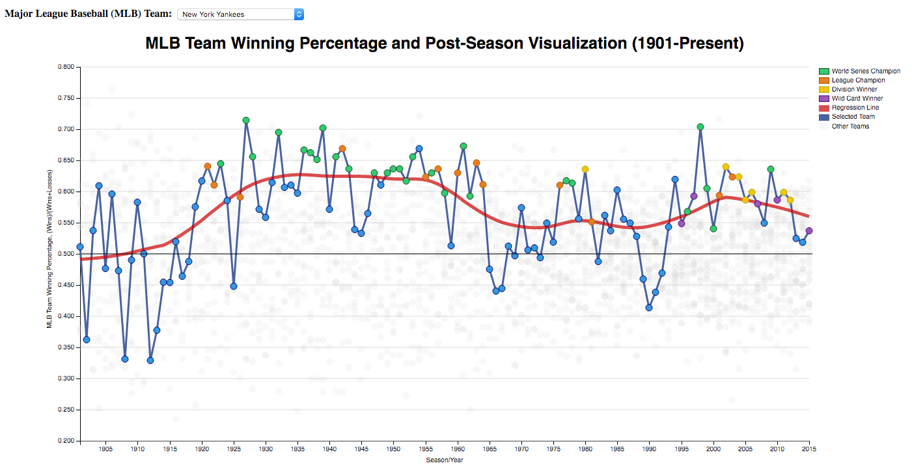
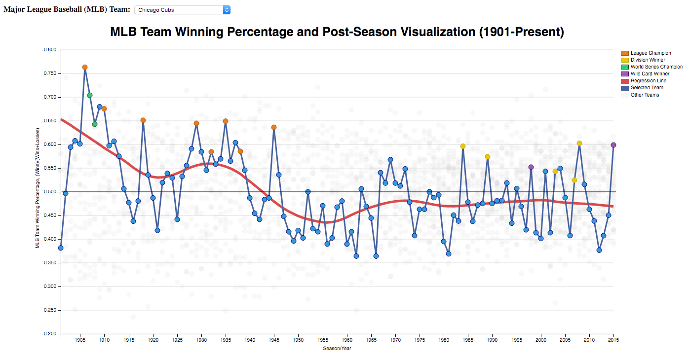

# MLB Baseball Team History Visualization   

## Summary

This data visualization displays the winning percentage and post-season history of all 30 current Major League Baseball teams during the "modern era" (1901-Present). This visualization displays the season/year on x-axis, winning percentage on y-axis, and post-season results as different color data points.

## Examples

    

    

## Data Source

Sean Lahman’s Baseball Database 2015    
http://www.seanlahman.com/baseball-archive/statistics/     

## Resources

http://dimplejs.org/examples_index.html      
http://dimplejs.org/advanced_examples_viewer.html?id=advanced_custom_styling      
http://bl.ocks.org/d3noob/7030f35b72de721622b8     
http://bl.ocks.org/ckuijjer/6840308    
http://stackoverflow.com/questions/10784018/how-can-i-remove-or-replace-svg-content     
http://stackoverflow.com/questions/20905429/update-dimple-js-chart-when-select-a-new-option    
http://stackoverflow.com/questions/33799829/changing-colors-on-dimple-js-scatter-plot     
http://stackoverflow.com/questions/25416063/title-for-charts-and-axes-in-dimple-js-charts     
http://stackoverflow.com/questions/18620053/multi-series-in-dimplejs     
http://stackoverflow.com/questions/19590865/from-an-array-of-objects-extract-value-of-a-property-as-array    
http://stackoverflow.com/questions/14028148/convert-integer-array-to-string-at-javascript    
http://stackoverflow.com/questions/18359093/how-to-copy-javascript-object-to-new-variable-not-by-reference  
http://stackoverflow.com/questions/1129216/sort-array-of-objects-by-string-property-value-in-javascript     
http://www.w3schools.com/jsref/jsref_concat_string.asp    
http://www.w3schools.com/colors/colors_names.asp    
http://knowledgestockpile.blogspot.com/2011/12/drawing-straight-line-with-d3js.html    
https://github.com/jasondavies/science.js/       
http://fgnass.github.io/spin.js/    
