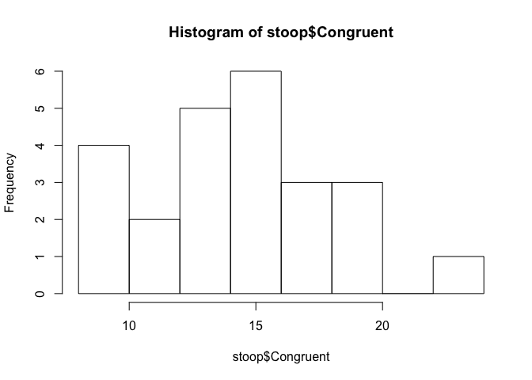
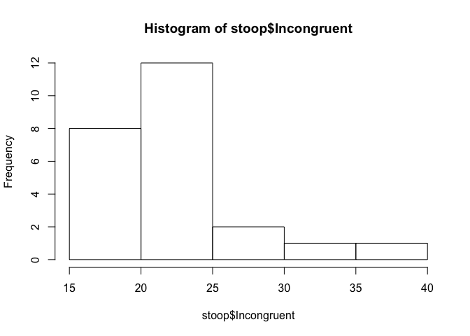

# Stoop Test - Statistical Analysis

# Background Information

In a Stroop task, participants are presented with a list of words, with each word displayed in a color of ink. The participant’s task is to say out loud the color of the ink in which the word is printed. The task has two conditions: a congruent words condition, and an incongruent words condition. In the congruent words condition, the words being displayed are color words whose names match the colors in which they are printed: for example RED, BLUE. In the incongruent words condition, the words displayed are color words whose names do not match the colors in which they are printed: for example PURPLE, ORANGE. In each case, we measure the time it takes to name the ink colors in equally-sized lists. Each participant will go through and record a time from each condition.

# Dataset

https://www.google.com/url?q=https://drive.google.com/file/d/0B9Yf01UaIbUgQXpYb2NhZ29yX1U/view?usp%3Dsharing&sa=D&ust=1453068181831000&usg=AFQjCNGvDg38ky7TLpuorzhPh0dcEXNt1g

# Methods

Software: R 3.2.3, Rstudio 0.99.489

Hardware: Macbook Pro 2.4 Ghz, 4 GB RAM, Mac OS X 10.11.2

# Questions For Investigation

## 1. What is our independent variable? What is our dependent variable?

Independent Variable: type of Stoop test, congruent words test vs. incongruent words test

Dependent Variable: time to complete test (seconds)

## 2. What is an appropriate set of hypotheses for this task? What kind of statistical test do you expect to perform? Justify your choices.

Null Hypothesis (H0): population mean time to complete congruent word test (μ(C)) is equal to the population mean time to complete incongruent words test μ(IC)

H0: μ(C) = μ(IC)

H0: μ(IC) - μ(C) = 0

Alternative Hypothesis (H1): population mean time to complete congruent word test μ(C) is not equal to the population mean time to complete incongruent words test μ(IC)

H1: μ(C) ≠ μ(IC) (a two-tailed test)

H1: μ(IC) - μ(C) ≠ 0 (a two-tailed test)

Statistical Test: Paired, 2-Sided, 2-Sample T-Test

Justification: Each test has less than 30 samples, and we don't know the population standard deviation (t-test). Both tests were performed by the same participants (paired). Without looking at the data, I am not sure of the direction of the data or which test will result in longer/shorter times (2-sided). (Also, we assume that the distributions are Gaussian.)

## 3. Report some descriptive statistics regarding this dataset. Include at least one measure of central tendency and at least one measure of variability.


```r
# load data
stoop <- read.csv("stroopdata.csv")

# preview data, descriptive stats
str(stoop)
```

```
## 'data.frame':	24 obs. of  2 variables:
##  $ Congruent  : num  12.08 16.79 9.56 8.63 14.67 ...
##  $ Incongruent: num  19.3 18.7 21.2 15.7 22.8 ...
```

```r
summary(stoop)
```

```
##    Congruent      Incongruent   
##  Min.   : 8.63   Min.   :15.69  
##  1st Qu.:11.90   1st Qu.:18.72  
##  Median :14.36   Median :21.02  
##  Mean   :14.05   Mean   :22.02  
##  3rd Qu.:16.20   3rd Qu.:24.05  
##  Max.   :22.33   Max.   :35.26
```


```r
# mean and sd, central tendency and variability
mean(stoop$Congruent)
```

```
## [1] 14.05113
```

```r
sd(stoop$Congruent)
```

```
## [1] 3.559358
```

```r
mean(stoop$Incongruent)
```

```
## [1] 22.01592
```

```r
sd(stoop$Incongruent)
```

```
## [1] 4.797057
```

Congruent Test Data: 14.05113 +/- 3.559358 (mean +/- standard deviation) (seconds)

Incongruent Test Data: 22.01592 +/- 4.797057 (mean +/- standard deviation) (seconds)

## 4. Provide one or two visualizations that show the distribution of the sample data. Write one or two sentences noting what you observe about the plot or plots.


```r
# histogram, sample distributions
hist(stoop$Congruent)
```

\

```r
hist(stoop$Incongruent)
```

\

Congruent data distribution is approximately normal and symmetric. However, it might be skewed slightly right. Due to the small sample size, it is hard to draw a conclusion.

Incongruent data is not normal or symmetric. It is strongly skewed right. Data appears to have a greater spread/variance. Also, this data has higher maximum values up to 30-40 seconds.

## 5. Now, perform the statistical test and report your results. What is your confidence level and your critical statistic value? Do you reject the null hypothesis or fail to reject it? Come to a conclusion in terms of the experiment task. Did the results match up with your expectations?


```r
# run t-test, paired, two-sided, two-sample, variance not assumed equal
t.test(stoop$Incongruent, stoop$Congruent,
       alternative="two.sided", paired=TRUE, var.equal=FALSE,
       conf.level = 0.95)
```

```
##
## 	Paired t-test
##
## data:  stoop$Incongruent and stoop$Congruent
## t = 8.0207, df = 23, p-value = 4.103e-08
## alternative hypothesis: true difference in means is not equal to 0
## 95 percent confidence interval:
##   5.910555 10.019028
## sample estimates:
## mean of the differences
##                7.964792
```

T Statistic = 8.0207

T Critical Statistic = 2.069, when sf = 23 and alpha = 0.95

Thus, T statistic > T critical statistic

P Value: 4.103e-08

Thus, P Value <<< alpha of 0.95

Confidence level is extremely high, less than 0.00001% chance this difference is due to random chance.

Thus, we reject null hypothesis. The two samples are significantly different.

95% confidence interval of mean(incongruent)-mean(congruent) = 5.910555 to 10.019028. 95% CI does not include 0.

With respect to the Stoop experiment, this means that the time to complete the congruent test is significantly different from the time to complete the incongruent test. The incongruent test takes an average of 7.964792 seconds (95% CI: 5.910555 to 10.019028) longer to complete.

Yes, these results matched my expectations that the two tests would take significantly different times to complete. It makes sense that the incongruent test takes longer to complete. Personally, it took me longer to complete the incongruent test, but I was not sure that others would have the same experience as me. Hence, I did the 2-sided t-test instead of the 1-sided t-test. Looking back now, a 1-sided t-test might be more appropriate.

## 6. Optional: What do you think is responsible for the effects observed? Can you think of an alternative or similar task that would result in a similar effect?

Source: https://faculty.washington.edu/chudler/words.html

The words themselves have a strong influence over your ability to say the color. The interference between the different information (what the words say and the color of the words) your brain receives causes a problem. There are two theories that may explain the Stroop effect:

Speed of Processing Theory: the interference occurs because words are read faster than colors are named.

Selective Attention Theory: the interference occurs because naming colors requires more attention than reading words

Other similar tests:
Turn the words upside down or rotate them 90 degrees.
Use emotional words such as "sad" or "happy" or "depressed" or "angry."
Color only half of the word or color only the first and last letter of each word.
